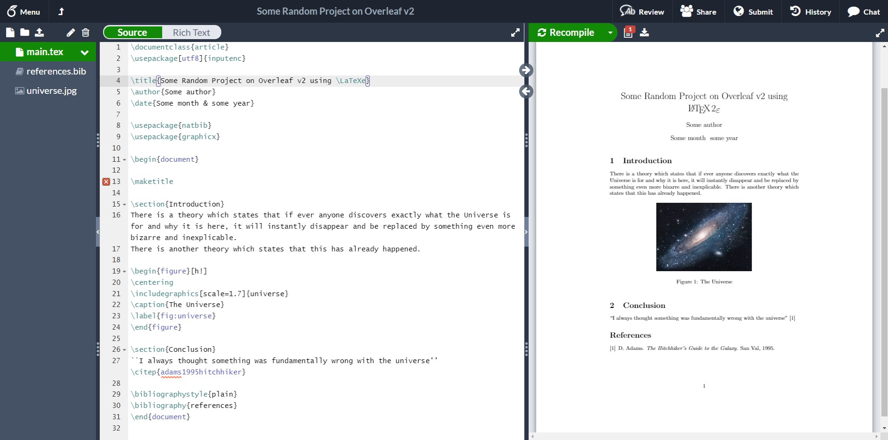

# Collaborative editing with overleaf {#overleaf}

If you are the sole author of a document, then compiling files on your local machine is fine. However, if you need to collaboratively co-author a document with other people, you'll need to share your TeX somehow. Sharing `*.tex` files by email or dropbox or whatever would be cumbersome. What you need is something like Google Docs for `*.tex`. Overleaf ([overleaf.com](https://www.overleaf.com/)) is one of several web applications that allows you to do this, shown in the screenshot in Figure \@ref(fig:overleaf-fig).

```{r overleaf-fig, echo = FALSE, fig.align = "center", out.width = "100%", fig.cap='(ref:captionoverleaf)'}

```

(ref:captionoverleaf) A screenshot of overleaf showing the source TeX on the left hand side and the corresponding pdf on the right hand side. Screenshot by Dan Cherniy via Wikimedia Commons at [w.wiki/omo](https://w.wiki/omo)

Compared to LaTeX, overleaf is relatively new. Write Latex Limited, the company behind overleaf was founded fairly recently (in LaTeX terms) in 2013 by [John Lees-Miller](https://www.linkedin.com/in/jdleesmiller/) and [John Hammersley](https://www.linkedin.com/in/john-hammersley-6419a266/). Overleaf has several features which you might find useful:

* Your documents are automatically saved to the cloud
* Packages, class files, compilers and other LaTeX components are also in the cloud, saving you time installing and managing them
* Templates are provided for common types of documents, although you don't need to use overleaf to get access to LaTeX templates^[see http://www.tug.org/texshowcase and https://www.latextemplates.com for example]
* Overleaf publish lots of tutorials to help you learn LaTeX


## Exercise four: overleaf {#ex4}

Login to [overleaf.com](https://www.overleaf.com/) and try the following:

1. Create and save a simple document using the overleaf tutorial *creating a document in overleaf*^[https://www.overleaf.com/learn/how-to/Creating_a_document_in_Overleaf]  
1. Note that overleaf allows you to store your TeX source in a git repository so you can use version control if you want to
1. Browse the overleaf tutorials at [overleaf.com/learn](https://www.overleaf.com/learn) and ask questions on forums like [tex.stackexchange.com](https://tex.stackexchange.com/) if you want to take things further

## Summary {#overleafconc}

Overleaf provides a modern and convenient cloud based interface to tried and tested LaTeX tools, which have been around for over thirty years. [@knuth] It also allows you to share the source of your documents while providing some handy templates for common document types. Overleaf and the command line are just two popular interfaces to LaTeX amongst many others. [@latexproject] Which interface is “best” for you will largely depend on what kind of documents you are writing and what your workflow is. In the next chapter we will create a curriculum vitae using CV templates provided by overleaf.
