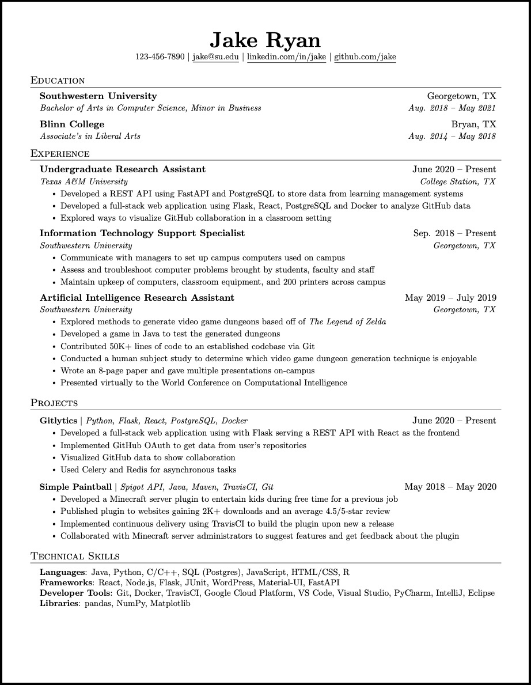

# Your curriculum vitae {#cv}

You'll write many documents at University, but there is one document that is **really** important in a potentially life-changing way. Your curriculum vitae^[strictly speaking it should be vitæ (not vitae) if you're being pedantic] or resume. An example CV is shown in Figure \@ref(fig:cv-fig).

```{r cv-fig, echo = FALSE, fig.align = "center", out.width = "100%", fig.cap='An example CV using an overleaf template. Would you invite Jake to interview based on his CV? These are the kinds of decisions that are made based on your CV. There are many other CV templates available, this one is by Jake Gutierrez and published under an MIT license at [overleaf.com/latex/templates/jakes-resume/syzfjbzwjncs](https://www.overleaf.com/latex/templates/jakes-resume/syzfjbzwjncs)'}

```
Creating a professional looking CV is particularly important, because it determines if you are invited to interview for opportunities you are applying for. The decision to interview is typically based on:

* how your CV looks, the typesetting, layout and style (typography)
* the content of your CV, what you've done and how you describe it
* the quality and clarity of your written communication
* the editing, what you've decided to leave in (and leave out) of your CV

By opportunities we mean both immediate ones within the next 12 months as well as those further in the future. These opportunities might include:

* Spring insights during easter next year^[see the essential guide to student insights at https://www.ratemyplacement.co.uk/insights] some of which have application deadlines before Christmas
* Summer internships next year or during subsequent summers^[see where can I look for jobs? https://waggle.cs.manchester.ac.uk/waggle/search]
* Year long placements in your penultimate year, if you're considering doing [industrial experience](http://studentnet.cs.manchester.ac.uk/employment/placement/)
* Graduate jobs or graduate schemes
* Postgraduate study or research via masters or PhD

So it is well worth investing a bit of your time to create version 1.0 of your CV. Yes, you've only just started University but it's never too early to make a start.

## Exercise five: your CV {#ex5}

Create a basic CV which tells your story including:

* your education, including high school and University
* your experience, voluntary, paid, casual, technical and non-technical work
* your projects, both personal or at University and beyond

You can do this using the ready-made templates at [overleaf.com/gallery/tagged/cv](https://www.overleaf.com/gallery/tagged/cv)

## Debug your CV
As you progress through University, keep your CV up to date, and continuously get feedback from as many people as you can. There will be opportunities to debug your CV later, but you’ll need a “beta release” (version 1.0) of your CV to get started. The best time to start debugging is now, so that you can squash any bugs before employers see them. Here's some common bugs we have seen in students CVs:

1. Is your year of graduation, degree program, University and expected (or achieved) degree classification clear?
1. Are there any spelling mistakes, typos and grammatical errors? Don't just rely on a spellchecker, they can't detect everything
1. Does it look good, decent layout, easy to scan?
1. Does it fit comfortably on one page (preferably) or two pages only? Not too cramped or gappy?
1. Is it in reverse chronological order? Are the most important (usually recent) things first?
1. Have you talked about what you have actually done using prominent verbs, rather than just what you know? See [git.io/verbsfirst](http://git.io/verbsfirst) for examples
1. Have you mentioned things you are studying now and throughout the current academic year, not just courses you have finished?
1. Have you quantified and provided evidence for the claims you make?
1. Is your CV robot proof? Many large employers use automated applicant tracking systems where your CV is screened by software long before a human ever sees it. Feed it through software like [careerset.io/manchester](http://careerset.io/manchester) and [resume.io](https://resume.io/), what feedback do the robots give you? How can you make your CV more robot proof?
1. Find out more in the *Debug your CV* [@debugcv] guide at [git.io/mycv](http://git.io/mycv)


## Summary {#cvconc}

Your curriculum vitae is a *really* important document and it will most likely take many iterations to get it right. We recommend you start working on it sooner rather than later and get feedback from as many different people (and bots) as you reasonably can. We hope you enjoy using LaTeX to create professional documents for:

* your individual COMP101 coursework (see blackboard)
* your CV / resume
* your third year project dissertation. It might seem a long way off now but it comes around very quickly!

...and more.
