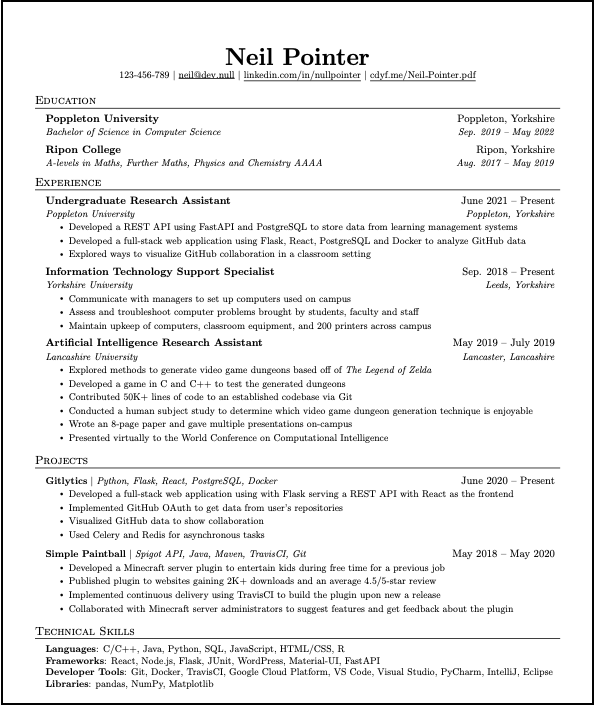

# Your Curriculum Vitae {#cv}

You'll write many documents at University, but there is one document that is **really** important in a potentially life-changing way. Your curriculum vitae^[strictly speaking it should be vitæ (not vitae) if you're being pedantic] or resume. An example CV is shown in Figure \@ref(fig:cv-fig).

```{r cv-fig, echo = FALSE, fig.align = "center", out.width = "100%", fig.cap='(ref:captioncv)'}

```

(ref:captioncv) A fictitious example CV using an overleaf template. Would you invite Neil to interview based on his CV? This is what your CV needs to do, convince a decision maker they really need to contact you to find out more. This is just a screenshot, the pdf can be found at [cdyf.me/Neil_Pointer.pdf](https://www.cdyf.me/Neil_Pointer.pdf). There are over 600 CV templates available to choose from at [overleaf.com/gallery/tagged/cv](https://www.overleaf.com/gallery/tagged/cv)

Creating a professional looking CV is particularly important, because it determines if you are invited to interview for *opportunities* you are applying for. The decision to interview is typically based on several factors:

* how your CV looks, the typesetting and style (typography)
* the content of your CV, what you've done
* the quality and clarity of your written communication, how you describe yourself and your experience
* the editing, what you've decided to leave in (and leave out) of your CV

## Using your CV to get a job interview {#knocking}
By *opportunities* we mean both immediate ones within the next 12 months as well as those further in the future. To make the most of those opportunities, your CV needs to be persuasive enough to make an employer think they should invite you to interview.


### Job opportunities for first year students {#startearly}

During your first year of study, *opportunities* include insight events and summer internships:

* Spring insights, usually occur during easter vacation, and require you to apply before (or shortly after) Christmas, see
    + insight events at [bit.ly/gradcracker-spring-insights](https://bit.ly/gradcracker-spring-insights) 
    + and [ratemyplacement.co.uk/insights](https://www.ratemyplacement.co.uk/insights) 

* Summer internships suitable for first year, see:
    + summer internships (open to first years) at [bit.ly/gradcracker-first-years](https://bit.ly/gradcracker-first-years)
    + the chapter on *[Finding your Future](https://www.cdyf.me/finding)* in *Coding your Future* [@findingyourfuture] for other places you can look

### Subsequent opportunities {#afterfirst}

After your first year *opportunities* include:

* Year long placements in your penultimate year, if you're considering doing [industrial experience](http://studentnet.cs.manchester.ac.uk/employment/placement/)
* Summer internships (aimed at penultimate year students)
        + there are usually around ten summer internships in the Department of Computer Science for example, these *normally* don't get advertised around April/May time
* Graduate jobs or graduate schemes after graduation
* Postgraduate study or research via masters or PhD etc

Any time you invest in creating a convincing CV will pay off in the long run. Yes, you've only just started University, so might not have much to talk about just yet, but it's never too early to make a start.

## Exercise five: your CV {#ex5}

Create a basic CV which tells your story, in particular:

* your *education*, including high school and University
* your *experience*, voluntary, paid, casual, technical and non-technical: *any* experience demonstrates your range of soft and hard skills
* your *projects*, personal, social, educational and entrepreneurial

You can do this using the ready-made templates at [overleaf.com/gallery/tagged/cv](https://www.overleaf.com/gallery/tagged/cv). Have a good look around, there are over 600 templates to choose from.

## Beware of weird LaTeX templates {#weird}

LaTeX packages like [hyperref](https://www.overleaf.com/learn/latex/Hyperlinks) are used in several of the CV templates above. They sometimes default to weird and unusual styles, such as drawing an ugly cyan box around hyperlinks using `urlcolor-cyan`. This looks horrible, but you can over-ride by using something like this: 

```tex
\href{https://www.cdyf.me}{\textcolor{blue}{\underline{cdyf.me}}}
```


## Debugging your CV checklist
As you progress through University, continuously update your CV and solicit feedback from as many people as you can. Your fellow students, personal tutors, friends, family and anyone else you trust can all give you valuable feedback. There will be opportunities to debug your CV later, but you’ll need a “beta release” (version 1.0) of your CV to get started. The best time to start debugging is now, so that you can squash any bugs before employers see them. Innocent bugs **can be fatal** because most employers typically have to deal with lots of applicants. Here's a check list of some common bugs we have seen in students CVs:

1. Is your year of graduation, degree program, University and expected (or achieved) degree classification clear?
1. Are there any spelling mistakes, typos and grammatical errors? Don't just rely on a spellchecker, they can't detect everything
1. Does it look good, decent layout, easy to scan?
1. Does it fit comfortably on one page (preferably) or two pages only? Not too cramped or gappy?
1. Is it in reverse chronological order? Are the most important (usually recent) things first?
1. Have you talked about what you have actually done using prominent verbs, rather than just what you know? See  the *[Verbalising your Future](https://www.cdyf.me/verbalising)* chapter of *Coding your Future* for more examples
1. Have you mentioned disciplines you are studying now and throughout the current academic year, not just courses you have finished?
1. Have you quantified and provided evidence for the claims you make?
1. Is your CV robot proof? Many large employers use automated applicant tracking systems that use software to screen CVs long before a human ever sees them. You can feed your CV through software like [careerset.com/manchester](http://careerset.com/manchester) and [resume.io](https://resume.io/), what feedback do the robots give you? How can you make your CV more robot proof?
1. Find out more in the *debugging your future* checklist at [cdyf.me/debugging#checklist](https://www.cdyf.me/debugging#checklist) [@debugyourfuture]
1. If you're a University of Manchester student, take a look at the CV pathway from the careers service at [bit.ly/uomcvpathway](https://bit.ly/uomcvpathway) which requires a `careerconnect.manchester.ac.uk` login - unfortunately *not* the same as your University credentials


## Summary {#cvconc}

Your curriculum vitae is a *really* important document and it will most likely take many iterations to get it right. We recommend you start working on it sooner rather than later and get feedback from as many different people (and bots) as you reasonably can.

In the meantime, enjoy exploring and using LaTeX to create professional documents for:

* your individual COMP101 coursework (see blackboard)
* your CV / resume
* your third year project dissertation. It might seem a long way off now but it comes around very quickly!

...and more.


<!--

limitations of LaTeX
limitations of pdf
The Stoic Resilience of PDF Within a Digital Ecosystem
https://www.overleaf.com/learn/latex/Articles/The_Stoic_Resilience_of_PDF_Within_a_Digital_Ecosystem

ada lovelace integral
https://www.claymath.org/publications/ada-lovelaces-mathematical-papers

markdown, bookdown, pandoc

appendix with stuff from SRP

-->
